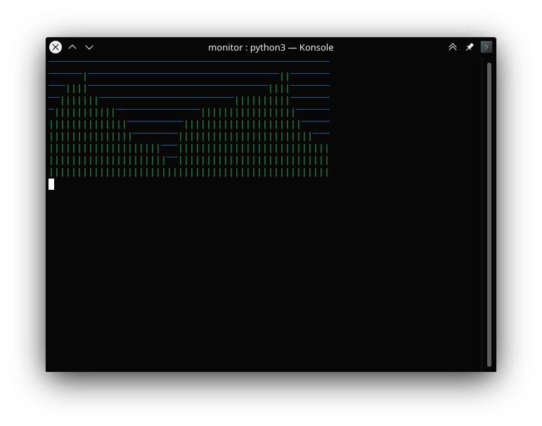
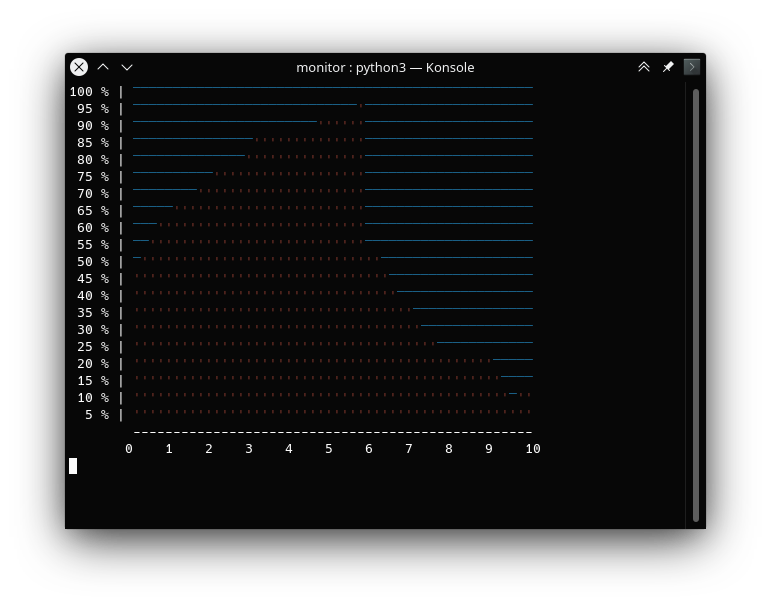

## monitor

Monitor em tempo real com forma de gráfico.

Wilden Alisson Gomes https://github.com/w-a-gomes

https://github.com/w-a-gomes/monitor

*Screenshot*





Exemplo, como na screenshot acima:

```python3
import time
import os

import monitor
import status

#  Neste teste, será gerado números aleatórios, decrementando e incrementando
# para emular números de estatísticas ou status, números que ficam com valor
# alto e depois abaixam. Isso será feito com uma classe utilitária -> StatusEmulator

status_emulator_1 = status.StatusEmulator(min_value=0, max_value=10)
status_emulator_2 = status.StatusEmulator(min_value=0, max_value=20)

#  O primeiro monitor (small_monitor) é exibido em uma só string
#  O segundo monitor (big_monitor) é exibido linha por linha em um loop 'for'. Isso
# dará a capacidadede de adicionar informações antes e depois de cada linha
#
#  *Lembrete: O valor da quantidade de linha corresponde ao valor máximo do status,
# então um valor real de status deve ser dividido para quantidade de linhas do monitor

# Exemplo 1:
small_monitor = monitor.Monitor(columns=50, lines=10)
for loop in range(70):
    os.system("clear")
    print(small_monitor.get_as_color_str(status_emulator_1.get_value()))
    time.sleep(0.1)

# Exemplo 2:
big_monitor = monitor.Monitor(columns=50, lines=20, primary_color="red-dark", primary_character="'")
for loop in range(70):
    os.system("clear")

    vertical_label_num = 100  # Números serão uma etiqueta na vertical antes do monitor
    for line in big_monitor.get_as_color_list(status_emulator_2.get_value()):
        print(("  " + str(vertical_label_num))[-3:] + " % |", line)
        vertical_label_num -= 5

    print("        " + "-" * 50)  # Desenha as etiquetas da horizontal
    print("       0    1    2    3    4    5    6    7    8    9    10")
    time.sleep(0.1)
```
